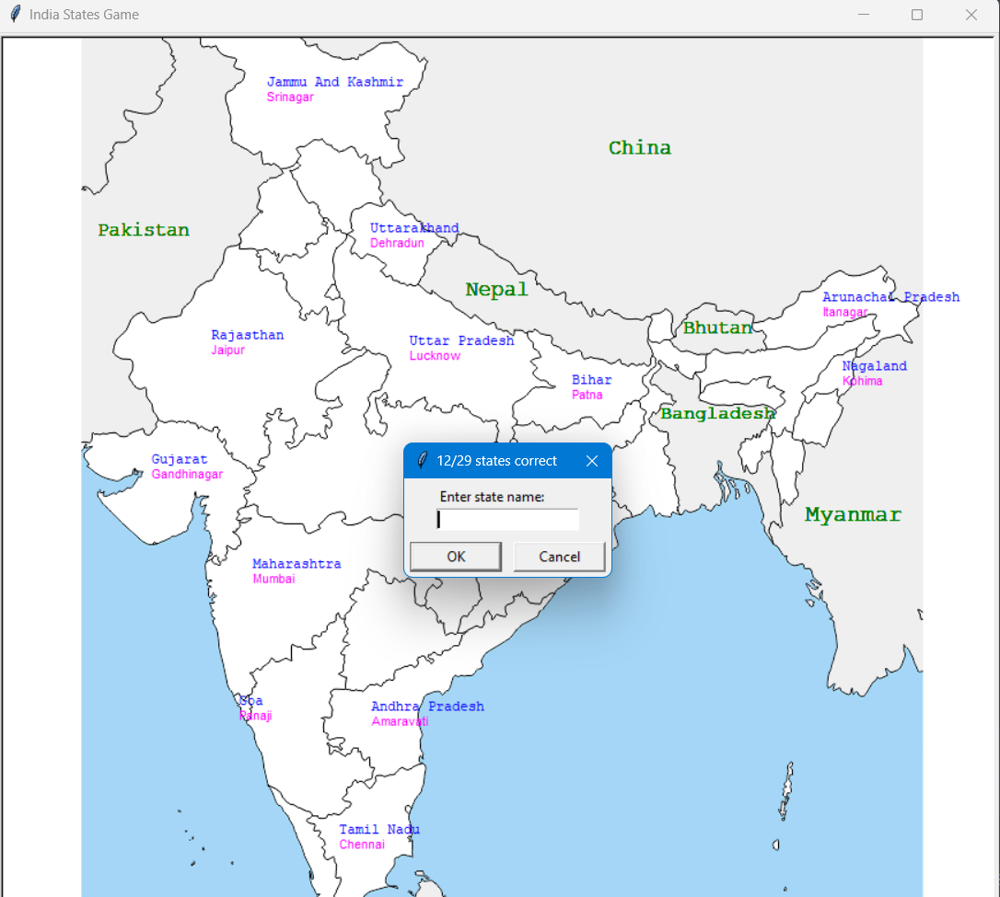

This is an Indian States Game, where you have to fill the name with the states, and it will be displayed 
to the exact location in the map.

`NEW Additions are`:

⭐ It will also display the `capital` of the state that you type  
⭐ simplified the code, so that each time no new turtle objets need to be created  
⭐ Now, it will also display the congratulations message, if you fill all the states correctly.  

<!--  -->
Here are some images 👇

and,  <strong> to end the game, i.e, in case you want to see all the answers, so simply type `exit`
and all the remaining states along with their capital will show up. </strong>

